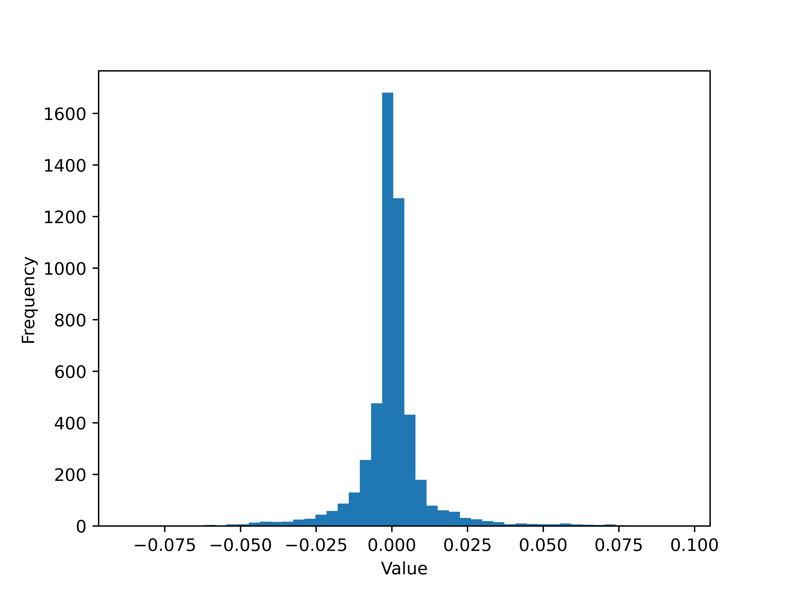

# Homework 1

#### 21210980124 ChengZhong

### 1. Project Reproduce

Follow the pipeline below you can reproduce the project:

1.  Download the project in Github repository
2. Download the model and put it into `./model_save`
3. Run the `python main.py --train_mode 0` to reproduce the project

## 2. Gradient 

In order to build a two-layer neural network classifier using numpy, we first need to calculate the explicit gradient of each layer. In this task, I use two fully-connected layer with ReLU and cross-entropy loss.

Since github can not show the formulas in markdown format, you can refer to the report for full text.
For more information, you can refer to my code.

Reference: https://blog.csdn.net/csuyzt/article/details/81839388

## 3. Result

In this project, I use MNIST as dataset, it is an entry-level computer vision dataset that contains many pictures of handwritten digits and their labels.

### 3.1 Hyper-parameter search

In this project, the main task is to search the best hyper-parameter of hidden layer, learning rate and l2 regularization. The search space is list below

 
    Table 1 : The search space of hyper-parameter

|              |     Hidden     |         Learning rate         |        l2 regular         |
| :----------: | :------------: | :---------------------------: | :-----------------------: |
| Search space | 64,128,256,512 | 0.001, 0.005, 0.01, 0.05, 0.1 | 0.001,0.005,0.01,0.05,0.1 |

The best result of hidden size and l2-regular is list below

 
    Table 2 : The best result of hidden size(upper) and l2-regularzation(lower)

| Hidden size |            64             |             128             |            256             |            512            |
| :---------: | :-----------------------: | :-------------------------: | :------------------------: | :-----------------------: |
| Best Result | 0.9634 (lr:0.001, l2:0.1) | 0.9696 (lr:0.001, l2:0.001) | 0.9759 (lr:0.005, l2:0.01) | 0.9794 (lr:0.005,l2:0.01) |

|     l2      |           0.001           |           0.005            |           0.01           |          0.05           |           0.1            |
| :---------: | :-----------------------: | :------------------------: | :----------------------: | :---------------------: | :----------------------: |
| Best Result | 0.9633 (lr: 0.001, h: 64) | 0.9782 (lr: 0.005, h: 512) | 0.9794 (lr:0.005, h:512) | 0.9791 (lr:0.005,h:512) | 0.9733 (lr:0.005, h:256) |

From the result, the size of the hidden layer and l2-regular does not greatly affect the performance.

After fix the hidden layer as 512, and l2-regular as parameter as 0.01, the performance of learning rate is

 
    Table 3 : The best result of learning rate

|     lr      | 0.001  | 0.005  |  0.01  |  0.05  |  0.1   |
| :---------: | :----: | :----: | :----: | :----: | :----: |
| Best Result | 0.9713 | 0.9794 | 0.2295 | 0.1135 | 0.1135 |

It is obvious that when the learning rate is too large, the model performance drops significantly.

After hyper-parameter search, the best hyper-parameter pair is 

 
    Table 4 : The best hyper-parameter pair

|       | Learning rate | Hidden size | l2-regularzation | Result |
| :---: | :-----------: | :---------: | :--------------: | :----: |
| Value |     0.005     |    0.01     |       512        | 0.9794 |

### 3.2 Learning Curve

By fix the hyper-parameter as the best one, I draw the learning curve below. From the figure, the model coverages at about step 1000, and performs similarly on the validation and test sets. ![]{./fig/fc1_Weight.jpg}

### 3.3 Parameter visualization

Here I draw the histogram of layers' weight and bias.[Weights 1](./fig/fc1_Weight.jpg) 

From the figure, the distribution of weights in different layer are close, but the bias of the second layer is more dispersed than that of the first layer 
